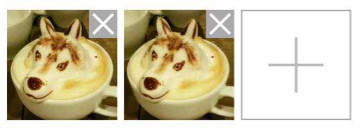

### Install

npm install @forzoom/uploader

### Desc

提供三种组件
1. Uploader
2. WechatUploader
3. InputUploader

### Usage

```
import Vue from 'vue';
import Uploader from '@forzoom/uploader';
Vue.use(Uploader, {
	.. // 额外配置
})
```

#### WechatUploader



大致上存在四种元素，分别是“容器”，“图片元素”，“添加按钮”，“图片容器”
嵌套结构为

    1. “容器”
	    2. “图片容器”
		    3. “图片元素”
		    3. 其他元素
	    2. “添加按钮”

上图中，“咖啡”图片实际上有一个“图片容器”和一个“图片元素”组成
第三个是一个“添加按钮”
点击添加按钮能够调用JSSDK中的图片上传逻辑

__根据需要，可以使用Props中的样式内容修改不同元素的样式__

##### Props

|名称|默认|说明|
|---|---|---|
|size|1|允许最大上传图片数量|
|canModify|true|是否允许修改|
|containerClass|\{\}|“容器”元素样式类|
|containerStyle|\{\}|“容器”元素样式|
|imageClass|\{\}|每个“图片元素”样式类|
|imageStyle|\{\}|每个“图片元素”样式|
|requestClass|\{\}|“添加按钮”样式类|
|requestStyle|\{\}|“添加按钮”样式|
|imageWrapClass|\{\}|“图片容器”样式类|
|imageWrapStyle|\{\}|“图片容器”样式|
|useWechatPreview|true|是否使用微信JSSDK预览|
|lazyload|false|是否使用vue-lazyload|

##### Events

|名称|参数|说明|
|---|---|---|
|load              |无       |图片上传到微信服务器开始|
|finish            |无       |图片上传到微信服务器结束|
|add               | \{ localId, serverId, \} |有图片增加|
|remove            |index (被删除图片位置)|有图片被删除|
|click             |index (被点击图片位置)|当正在显示的图片被点击|
|choose            | \{ localIds \} |图片来源|
|startRequest      |无       |request开始|
|endRequest        |无       |request结束|
|error             |错误信息  |发生错误|

###### load

图片开始上传到微信服务器，一般配置finish事件使用

```
<WechatUploader @load="onLoad">
</WechatUploader>

export default {
	methods: {
		onLoad() {
			// 展示加载动画
		},
	},
};
```

#### finish

图片上传到微信服务器结束，一般配置load事件使用

```
<WechatUploader @finish="onFinish">
</WechatUploader>

export default {
	methods: {
		onFinish() {
			// 隐藏加载动画
		},
	},
};
```

##### 函数

|名称|参数|说明|
|---|---|---|
|request|无|发起图片上传|
|removeAll|无|删除所有图片|
|setImages|无|设置默认显示的图片|
|getImages|无|获得所有图片|

##### Example

###### WechatUploader.setImages

设置uploader中默认的图片内容（注意，如果uploader被销毁的情况下，设置的内容自然也会消失）

__html__

```html
<!-- size="4": 显示多少个图片 -->
<!-- can-modify="false": 不允许修改，只允许查看 -->
<WechatUploader
	ref="uploader"
	:size="4"
	:can-modify="true">
</WechatUploader>
```

__script__

```javascript
this.$refs.uploader.setImages([
	{
		image: '...', // 可以是url或者localId
		serverId: '...', // 可以不传入
	},
]);
```

###### WechatUploader.getImages

获得uploader中当前的图片内容

```javascript
const images = this.$refs.uploader.getImages();

// 结果是
[
	{
		image: '...',
		serverId: '...',
	},
]
```

### Types

```
// 表示<Uploader>组件的interface
export interface UploaderComponent {..}
// 表示<WechatUploader>组件的interface
export interface WechatUploaderComponent {..}
// 表示<InputUploader>组件的interface
export interface InputUploaderComponent {..}
```

### Roadmap

1. image之间添加间距
1. 更新rollup版本
